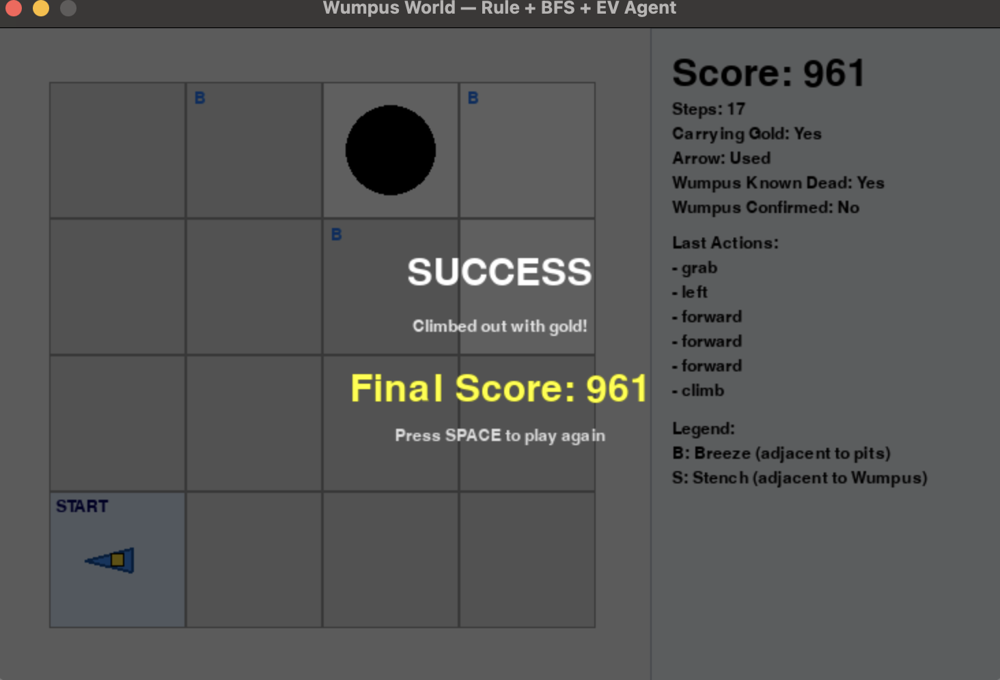

# 🧠 Hybrid Wumpus World Agent

An interactive **Wumpus World** simulator built in **Python + Pygame**, featuring a hybrid intelligent agent that blends:
- Rule-based reasoning
- Breadth-First Search (BFS)
- Expected-Value decision making

---

## 🎮 Preview


*(Replace with your own screenshot once you run it.)*

---

## 🚀 Features
- Procedurally generated 4×4 Wumpus World with random pits, gold, and a Wumpus
- Intelligent agent that:
  - Infers safe and unsafe tiles using deterministic logic
  - Identifies Wumpus location via **stench triangulation**
  - Plans routes via **BFS**
  - Balances exploration and risk using **Expected Value**
  - Shoots the Wumpus when location is confirmed and aligned
- Live visualization with cell colors, labels, and agent state sidebar

---

## 🧩 Controls
| Key | Action |
|-----|--------|
| `P` | Pause/Resume |
| `SPACE` | Restart after game over |
| `↑ / ↓` | Adjust animation speed |
| `ESC` | Quit |

---

## ⚙️ How to Run
Clone the repo and install dependencies:
```bash
git clone https://github.com/<your-username>/wumpus-world-agent.git
cd wumpus-world-agent
pip install pygame
```

Run the simulator:
```bash
python wumpus_world_single.py
```

---

## 🧱 Technical Highlights
- **Pygame** for UI & animation  
- **Dataclasses** for structured percepts and actions  
- **Hybrid Agent** design combining inference, search, and EV planning  
- Cleanly modularized logic for environment, agent, and rendering  

---

## 🧑‍💻 Acknowledgments
Developed by **Haleemah “Tayo” Amisu**  
AI debugging and algorithm refinement assisted by Google’s **Gemini AI**.

---

> “An intelligent agent’s courage is measured by its ability to reason under uncertainty.”
